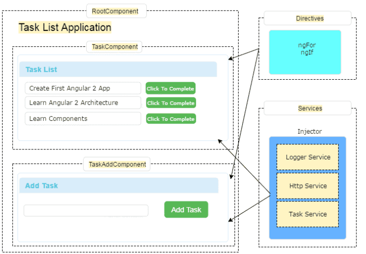
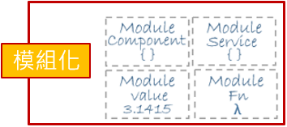
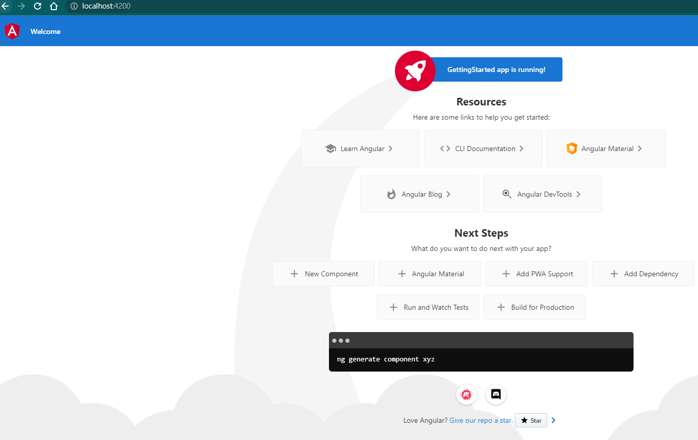

# Angular Beginner

## Angular 概念圖



- Components: 提供可顯示的視圖集合 ( known as Template).

- Services: 提供Component邏輯, 例如從資料庫提取資料等行為. 也就是自訂功能函式庫.

- Injector: 將 Service 透過 Dependency Injection 方法, 嵌入到 Components.

- Directives: 透過 Angular 註釋符 (*ngFor, *ngIf...等) 操控 DOM 的 方法.
<p>

Angular Application consists of several building blocks like **Components**, **Services**, **Directives**. We create more such blocks as the application grows. The Angular provides a nice way to organize these building blocks using the concept called Angular **Modules**.



### Component

The Component controls the part of our user interface (or view). 

## 創建一個新的 Angular 專案

- 下載,安裝與配置 Angular 庫和任何其他依賴項
  
  ```shell
  ng new GettingStarted  #GettingStarted是專案名稱
  ```
- Running your new Angular Project

  ```shell
  ng serve
  # 也可以使用"npm start"指令
  ```

  

- 錯誤排除: 某些情況可能導致 ng new GettingStarted 錯誤, 可以嘗試以下指令

  ```shell
  npm install source-map-resolve
  npm audit fix --force
  ```
  
  refer: https://stackoverflow.com/questions/72413811/npm-warn-deprecated-source-map-resolve0-6-0-see-https-github-com-lydell-sour

## 資料夾與檔案說明:

  - .editorconfig: Visual Studio code 設定檔

  - angular.json: Angular CLI 設定檔

  - browserslistrc: Angular app with different browsers.

  - karma.conf.js: karma test runner 設定檔

  - package.json: npm 設定檔

  - tsconfig.json, tsconfig.app.json & tsconfig.spec.json: Typescript 設定檔.

  - node_modules: node 的第三方依賴庫

  - src: 應用程式存放位置

  - Assets: 放置 images 等其他共用文件

  - Environments: 定義環境變數與開發設置

- src/app: The Angular CLI has created a simple application, which works out of the box. It creates the root component, a root module, a unit test class to test the component.

  - app.component.ts: It consists of three main parts i.e. a class, a class decorator, and an import statement.

    ```javascript
    // Import statement
    // This statement is similar to C# using statement. Our Component is decorated with the @Component decorator, which is part of the @angular/core module. 
    import { Component } from '@angular/core';

    // Component class
    // We define it using the export keyword. The other parts of the app can import it use it.
    // The component class can have many methods and properties. The main purpose of the component is to supply logic to our view.
    export class AppComponent {
        title = 'GettingStarted';
    }

    // @Component decorator
    // The @Component (called class decorator) provides Metadata about our component. The Angular uses this Metadata to create the view
    @Component({
        selector: 'app-root',
        templateUrl: './app.component.html',
        styleUrls: ['./app.component.css']
    })
    ```

  - app.component.html: is our template.The templateUrl in the component class above points to this class. Note that {{title}} is placed inside the h1 tags in line no 344. The double curly braces are the angular way of telling our app to read the title property from the component (AppComponent). 

    ```html
    <span>{{ title }} app is running!</span>
    ```

  - app.module.ts: The Modules are closely related blocks of code in functionality.This Module is our root module.

  - app-routing.module.ts: defines the Routes of the application. 

- 其他文件說明:

  - main.ts: we need to ask the Angular to load the AppModule when the application is loaded

  - index.html: is the entry point of our application.

    ```html
    <!-- 
        The selector app-root, which we defined in our component metadata is used as an HTML tag. The Angular scans the HTML page and when it finds the tag <app-root><app-root> replaces the entire content with content of app.component.html
    -->
    <body>
        <app-root></app-root>
    </body>
    ```

  - styles.css: Angular global styles

  - polyfills.ts: Different browsers have different levels of support of the web standards. Polyfills help normalize those differences.

  - test.ts :this is the main entry point for your unit tests


<hr>

Refer:

- [Complete Angular Tutorial For Beginners](https://www.tektutorialshub.com/angular-tutorial/#prerequisitesnbsp)

- [How to Create a new project in Angular](https://www.tektutorialshub.com/angular/angular-create-first-application/)
